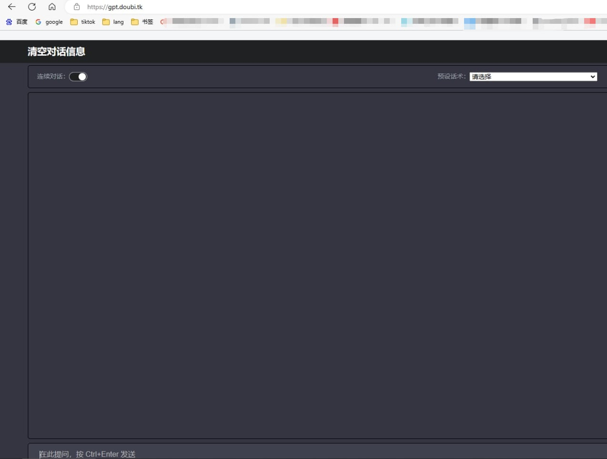
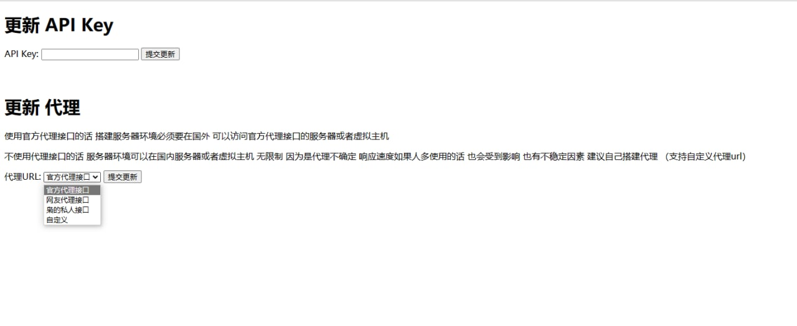

# ChatGPT
搭建属于自己的ChatGPT，国内可访问
- php环境 不需要数据库  我用的7.2   上传解压  打开就看到我截图的页面 无需安装
- 后台登陆地址/adminkey.php
- 账号:lang
- 密码:lang
- 把你的KEY写上 点更新
- 如果用官方的代{过}{滤}理URL必须是国外服务器
- 里面自带了两个代{过}{滤}理可以试试  也可以自定义
- 所有聊天记录会保存在chat.txt里面
- 内置N个预设的聊天话术

